# ESET-License-Generator
ESET License Generator - Генерує акаунти для активації пробного періоду

# Як застосувати

0. Завантажити [Microsoft Edge](https://www.microsoft.com/uk-ua/edge/home) та його [Stable драйвер](https://developer.microsoft.com/microsoft-edge/tools/webdriver/). Драйвер потрібно розпакувати і перемістити в папку з main.py. Далі встановити бібліотеки Python:

pip install selenium, requests

1. Далі потрібно відредагувати main.py під ваші потреби.
SIZE - число (int) яке вказує скільки потрібно створити акаунтів
OUTPUT - текст (str) який вказує куди потрібно записати дані створених акаунтів
SLEEP - число (int) яке вказує затримку між операціями в секундах

2. Запустити main.py та зачекати до Press Enter...
Після цього в OUTPUT вас буде чекати файл із акаунтами.
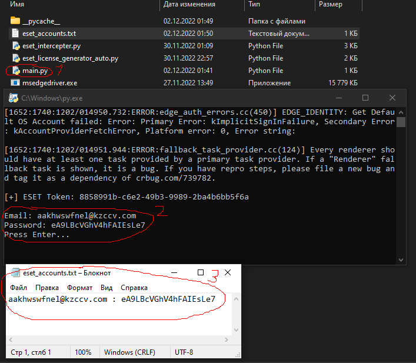

3. Зайти в ESET і видалити поточний акаунт ESET HOME
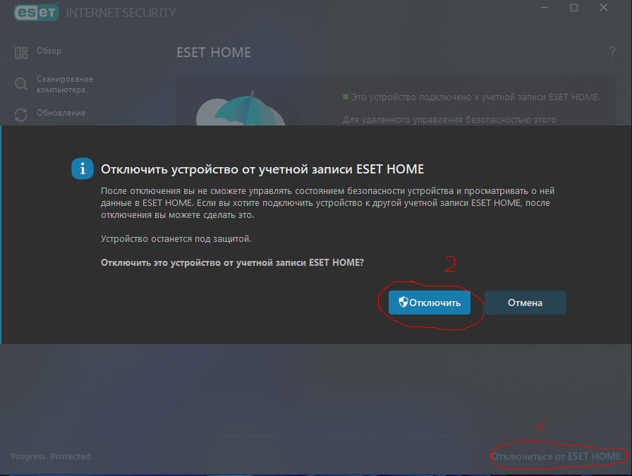

4. В ESET клікніть Активувати повну версію продукту та авторизуйтесь даними із OUTPUT файлу
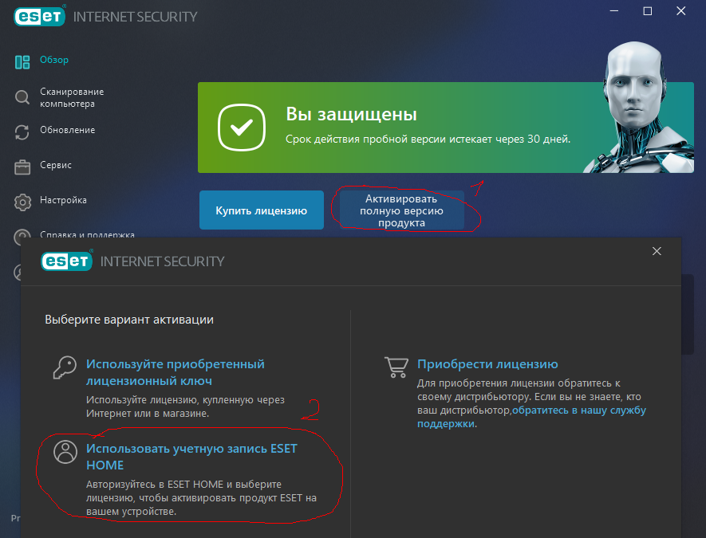
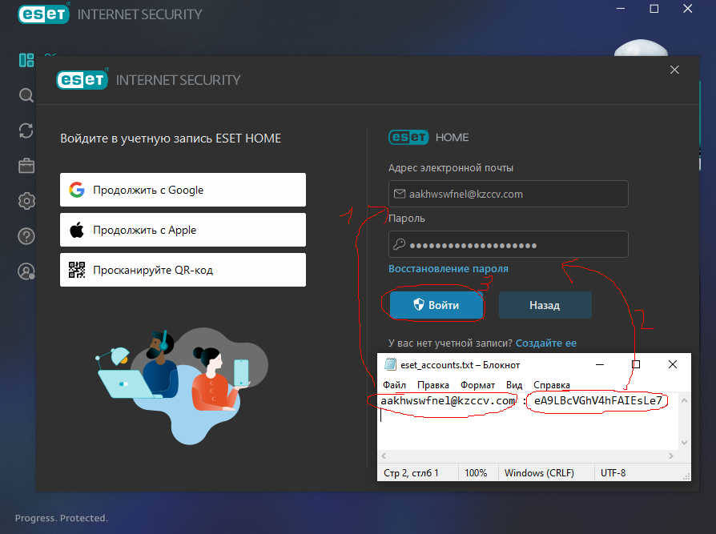
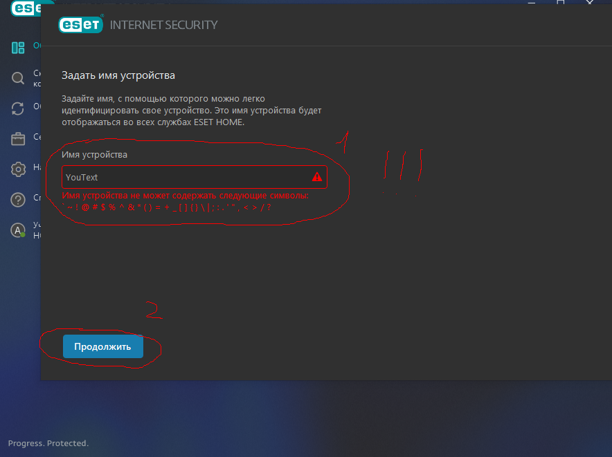
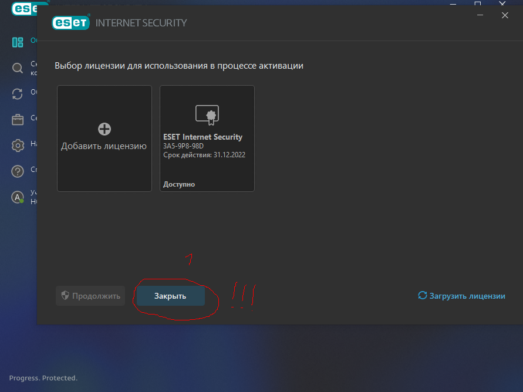

5. В браузері зайти на сайт [ESET HOME](https://login.eset.com/Login) та авторизуватись даними із OUTPUT файлу.
Зайдіть в розділ ліцензії, та видаліть поточну ліцензію
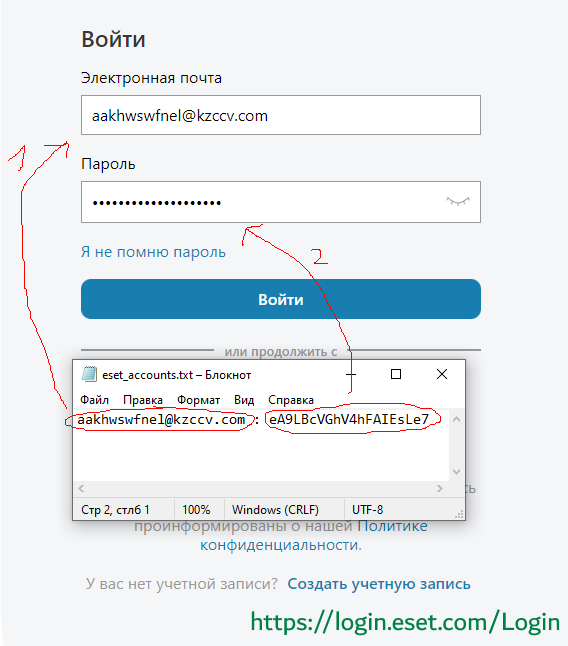

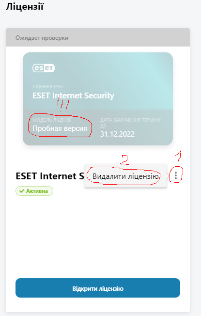
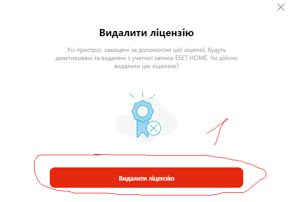

6. Поверніться в ESET, клікніть Активувати повну версію продукту та нажміть спробувати безкоштовно
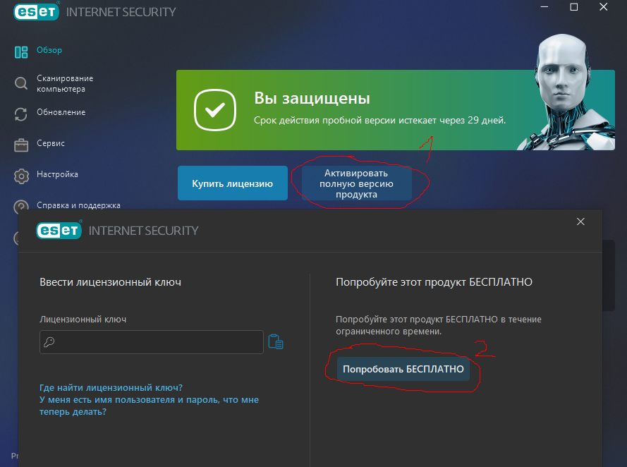
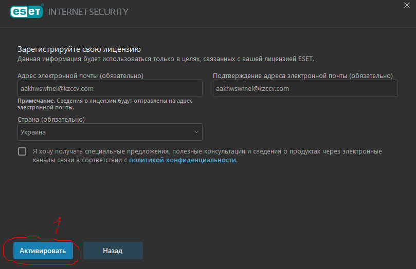
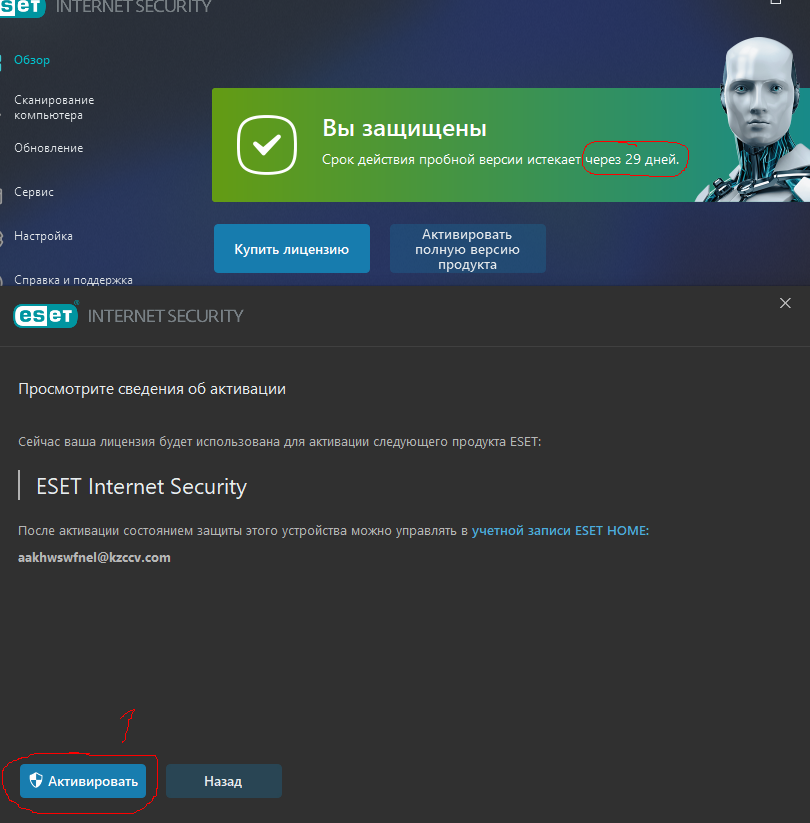
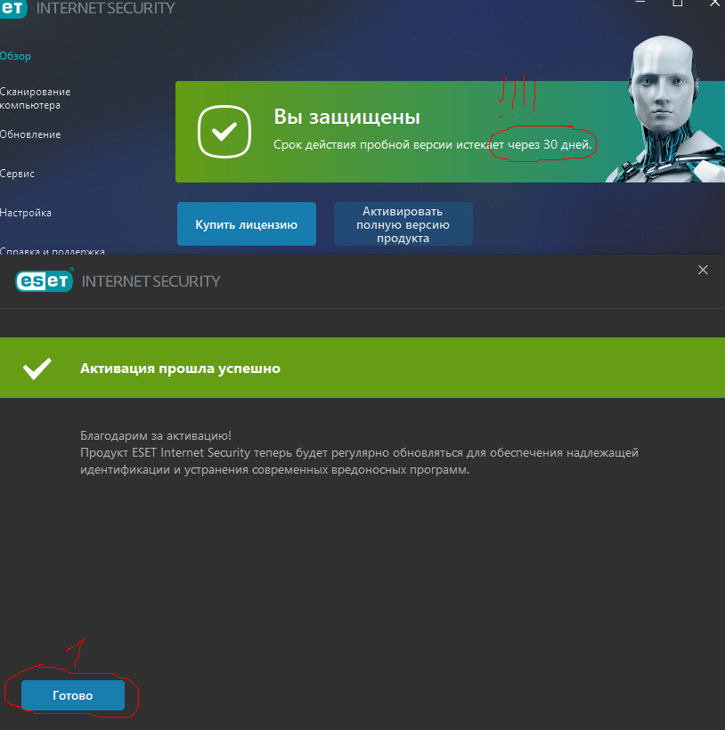

# Рекомендації та інформація

1. Затримку SLEEP краще вибирати в межах 1-3 хв, якщо вам потрібно більше 10 акаунтів

2. Не створюйте багато акаунтів за короткий проміжок часу інакше вас заблокує сайт ESET HOME на певний час

3. Якщо програма зависла і не пише ESET Token це означає що вас заблокував ESET HOME

4. Ви можете пропустити пункт 2, якщо ви маєте вже створений аккаунт цією програмою

5. Ви також можете пропустити пункт 1, якщо вам потрібно створити 1 акаунт. (main.py вже скоригований для цього)
6. ОДИН АКАУНТ = ОДНА ЛІЦЕНЗІЯ!!!
