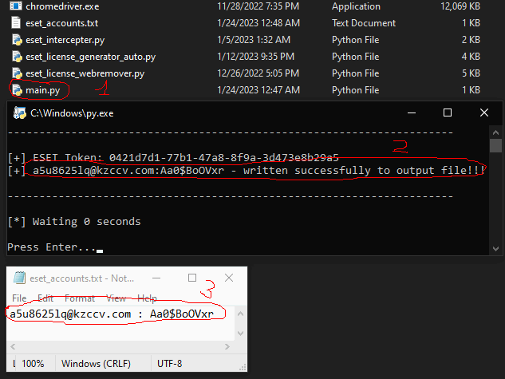

# ESET-License-Generator
ESET License Generator - Generates accounts to activate the trial period

# How to use

0. Download [Chrome](https://www.google.com/intl/ru/chrome/) and his [Stable Driver](https://chromedriver.chromium.org/). 

NOTE: If your version of chrome is for example 102.2.3.004 then you need to download a driver
      with the same version (Only the first 3 digits are taken into account, for example 102)

The driver must be unpacked and moved to the folder with main.py. Next, install the Python libraries, in cmd or powershell or other console:

pip install selenium requests

1. Next, you need to edit main.py to suit your needs.
SIZE - a number (int) indicating how many accounts to create
OUTPUT - text (str) indicating where to write the data of the created accounts
SLEEP - number (int) indicating the delay between operations in seconds

2. Run main.py and wait until Press Enter...
After that, you will see a file with accounts in OUTPUT

3. Log in to ESET and delete your current ESET HOME account

4. In ESET, click Activate full version of the product and authenticate with the data from the OUTPUT file

5. In your browser, go to the [ESET HOME](https://login.eset.com/Login) website and log in using the data from the OUTPUT file.
Go to the licenses section and uninstall the current license

6. Go back to ESET, click Activate full version and click Try for free

# Recommendations and information

1. SLEEP delay is better to choose within 1 min if you need 12 accounts

2. Do not create many accounts in a short period of time, otherwise you will be blocked in ESET HOME for a certain period of time

3. You can skip step 2 if you have already created an account in this program

4. You can run eset_license_generator_auto.py if you need to create 1 account. The credentials will be in the console (Not saved to a file!!!)

5. ONE ACCOUNT = ONE LICENSE !!!
